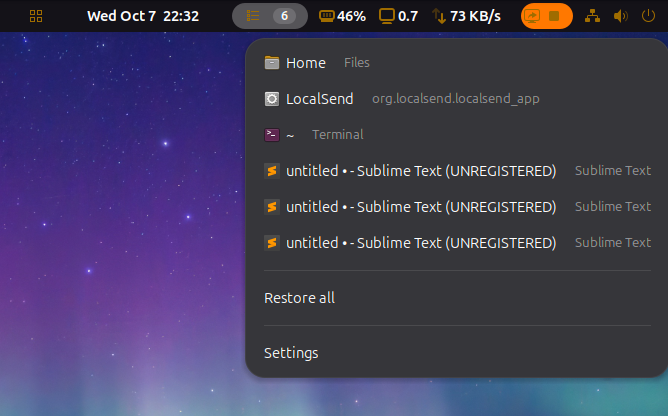
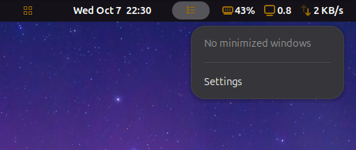
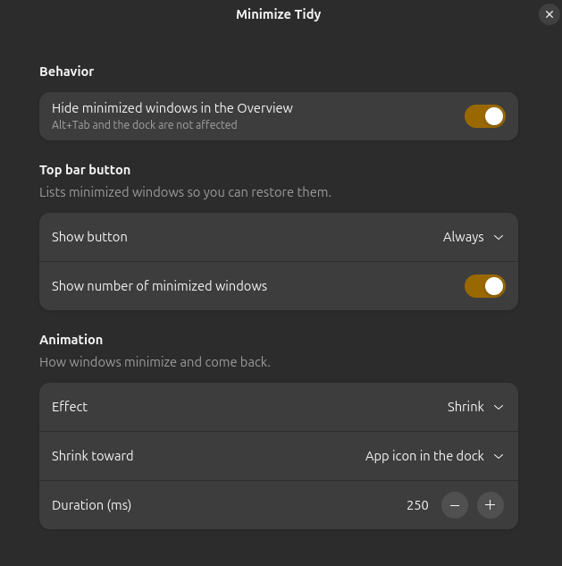

# Minimize Tidy

A GNOME Shell extension that keeps the Activities Overview tidy: minimized windows stay out of it, and a top bar menu lists them so you can bring them back in one click. Alt+Tab and the dock keep working as usual.

- Hides minimized windows from the Overview (can be turned off)
- Top bar menu with app icons, window titles and **Restore all**
- Optional count badge, and an option to show the button only when something is minimized
- Minimize animations: shrink into the app's dock icon or a screen corner, fade, flip, none, or the GNOME default, with adjustable duration

Supports GNOME 50. Available in English and Brazilian Portuguese (follows the system language).

## Preview

Top bar menu with minimized windows, count badge and **Restore all**:



Menu when nothing is minimized:



Preferences window:



## Development

```bash
./dev.sh      # installs and opens a nested GNOME Shell that restarts on every save (needs entr)
./install.sh  # installs into ~/.local/share/gnome-shell/extensions
./build.sh    # builds the zip for extensions.gnome.org (needs gnome-extensions)
```

Translations live in `po/`. To add a language, copy `po/pt_BR.po`, translate it and add the language code to `po/LINGUAS`.

## Credits

Based on [Hide minimized](https://github.com/danigm/hide-minimized) by Daniel Garcia Moreno.

## License

GPL-3.0-only
